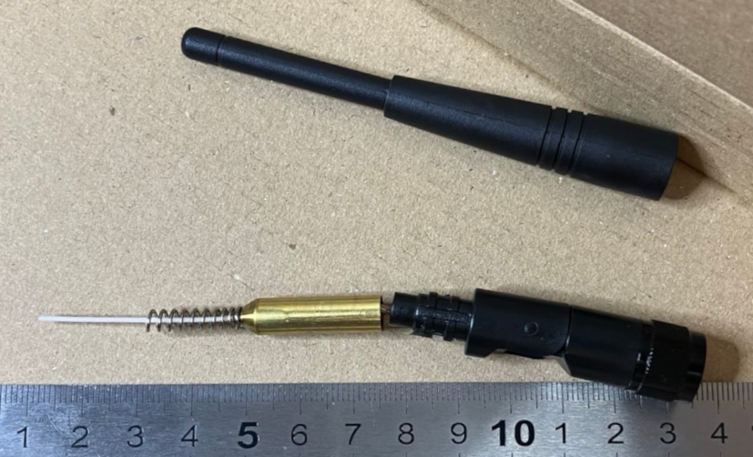

# Beyondoor

## Beyondoor Model BY-2400-05-03-868MHZ

I ended up with a couple free samples of these antennae from Jiaxing Beyondoor
from a local supplier.

The antenna is pretty sturdy looking and feeling and can be easily positioned
at 0, 45 and 90 degrees. The knurled part at the base is quite thick, about 
14.5mm diameter including the height of the knurling.

It was relatively easy to pull the plastic cap off and place it back on without
damaging it. In my case the glue inside was a bit sticky. (YMMV) For the 
patient, this means it is possible to tune by hand.

Measurements were made with a calibrated LiteVNA on 2024-05-29. Markers were 
positioned at 868Mhz (yellow) and the best VSWR (green). Neither antenna was
spot on but sample #2 performed resonably well with a SWR < 2 in all positions
at 868 MHz. Sample #1 didn't fare so well with SWR just over 3, not ideal,
as the reflected power has potential to damage more sensitive transmitters.

Sample #1 could possibly by hand tuned for a better SWR. The local suppliers
price for this antenna was about 4€ including the 24% VAT. It's a reasonable price
but if my samples are any indication of the typical measurements, then the
datasheet for this model is a little too optimistic.

[Datasheet](img/BY-2400-05-03-868MHZ.pdf)

### Measurements at 868 Mhz (yellow marker)

| Measurement | Frequency(MHz)  | VSWR | Return loss (dB)  |
| -- | -- | -- | -- |
| sample 1 0 deg  | 868 | 3.15 | -5.71 |
| sample 1 45 deg  | 868 | 3.17 | -5.69 |
| sample 1 90 deg  | 868 | 3.37 | -5.31 |
| sample 2 0 deg  | 868 | 1.77 | -11.1 |
| sample 2 45 deg  | 868 | 1.79 | -10.9 |
| sample 2 90 deg  | 868 | 1.93 | -9.97 |

### Measurements at Best VSWR/Return loss (green marker)

| Measurement | Frequency(MHz)  | VSWR | Return loss (dB)  |
| -- | -- | -- | -- |
| sample 1 0 deg  | 909 | 1.64 | -12.1 |
| sample 1 45 deg  | 907 | 1.64 | -12.3 |
| sample 1 90 deg  | 909 | 1.68 | -11.9 |
| sample 2 0 deg  | 890 | 1.50 | -13.9 |
| sample 2 45 deg  | 885 | 1.49 | -14.1 |
| sample 2 90 deg  | 892 | 1.53 | -13.5  |

### Antenna at O degrees (straight)
#### SAMPLE #1

#### SAMPLE #2

### Antenna at 45 degrees
#### SAMPLE #1

#### SAMPLE #2

### Antenna at 9O degrees
#### SAMPLE #1

#### SAMPLE #2

