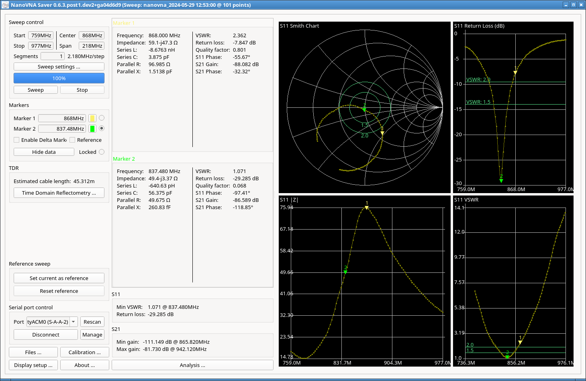

# GIZONT

##  GIZONT Nb-iot Soft Antenna 868MHz 20cm SMA soft whip

* GIZONT store on Aliexpress
* Description: Nb-iot Soft Antenna 915/900/840/868/902-928mhz UAV meter reading module Omnidirectional high-gain flexible antenna SMA soft whip
* Color: 868MHz 20cm
* Link: [Affiliate link](https://s.click.aliexpress.com/e/_DFhnibV) 

This arrived in the mail recently, sturdy enough and quite flexible. For the price, ok.

Measured VSWR was 2.36 at 868MHz. Return loss 7.85 db, so not the best but unlikely to damage a transmitter.

It's quite likely that I managed to send and recieve a Meshstastic message over the default Longfast channel over 90km on May 23, 2024, from Helsinki to Tallinn. The radio I used was a [Lilygo T-Beam Supreme.](https://s.click.aliexpress.com/e/_DCntvRh)

VNA measurements here:

