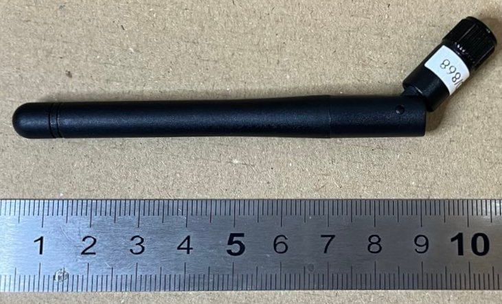
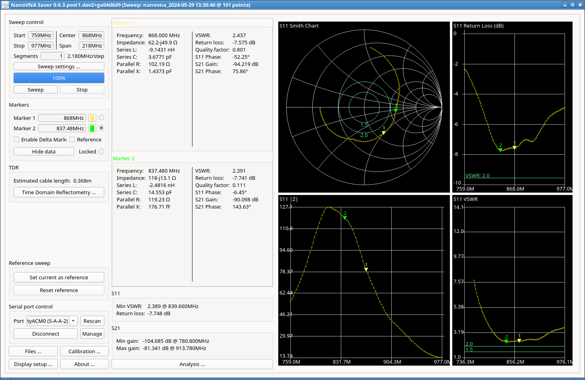
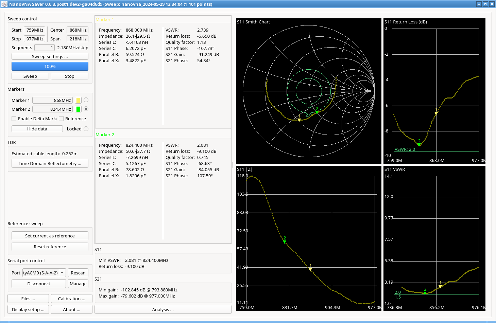

## LILYGO

### T-Beam supreme

This antenna came the a Lilygo t-beam supreme that I ordered recently.

Measurements were made with a calibrated LiteVNA on 2024-05-29. Markers were 
positioned at 868Mhz (yellow) and the best VSWR (green).

### Measurements at 868 Mhz (yellow marker)

| Measurement | Frequency(MHz)  | VSWR | Return loss (dB)  |
| -- | -- | -- | -- |
| TODO |

### Measurements at Best VSWR/Return loss (green marker)

| Measurement | Frequency(MHz)  | VSWR | Return loss (dB)  |
| -- | -- | -- | -- |
| TODO |

### Antenna at O degrees (straight)

### Antenna at 45 degrees

### Antenna at 9O degrees

